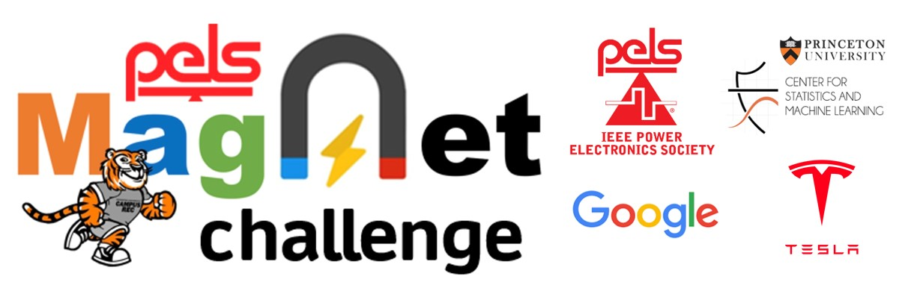
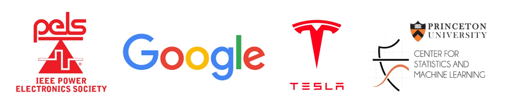

# MagNet Challenge 2023
## IEEE PELS-Google-Enphase-Princeton MagNet Challenge

## This site provides the latest information about the MagNet Challenge. 
## Please contact [pelsmagnet@gmail.com](mailto:pelsmagnet@gmail.com) for all purposes.

## **We reorganized the datasets and tools used in the MagNet Challenge and moved them to the following sites

[MagNet Open Database](https://www.princeton.edu/~minjie/magnet.html) - maintained by Princeton University

[MagNet-AI Platform](https://mag-net.princeton.edu/) - maintained by Princeton University

[MagNet Toolkit](https://github.com/upb-lea/mag-net-hub) - maintained by Paderborn University

## **We marked the completion of the MagNet Challenge 2023 by hosting an Award Ceremony at APEC 2024. The Award Ceremony was well attended with ~100 student participants and audiences. 

## **More information will be made available on the PELS website, together with information for tranferring the prize money. We are still in the process of tranferring the prize money between Princeton and IEEE. We will be in touch in a few weeks!

[APEC Pictures](https://drive.google.com/drive/folders/1-VbrRPGz0z3LtHOV-qnWxxeaa6QeXG4C?usp=sharing)

[APEC Slides](docs/ceremonyslides.pdf)

[Award Certificates](awards)

[Organizing Certificates](committee)

[Challenge Summary](docs/summary.pdf)

[Final Reports](finalreport)

[Submitted Models](models)

[Final Presentations](https://www.dropbox.com/scl/fo/y7mshho8g34w44smlxvy5/h?rlkey=mdsvpe27ayxc3zep881yl4iyh&dl=0)

The final winners of the MagNet Challenge 2023 are:

Performance Track : 
- 1st ($10000) Paderborn University, Paderborn, Germany 🇩🇪 
- 2nd ($5000) Fuzhou University, Fuzhou, China 🇨🇳
- 3rd ($3000) University of Bristol, Bristol, UK 🇬🇧
  
Innovation Track: 
- 1st ($10000) University of Sydney, Sydney, Australia 🇦🇺
- 2nd ($5000) TU Delft, Delft, Netherland 🇳🇱
- 3rd ($3000) Mondragon University, Hernani, Spain 🇪🇸

Honorable Mention ($1000): 
- Arizona State University, Tempe AZ, USA 🇺🇸
- Indian Institute of Science, Bangalore, India 🇮🇳
- Xi'an Jiaotong University, Xi'an, China 🇨🇳
- Zhejiang University-UIUC, Hangzhou, China 🇨🇳
- University of Tennessee, Knoxville, USA 🇺🇸
- Politecnico di Torino, Torino, Italy 🇮🇹
- Southeast University Team 1, Nanjing, China 🇨🇳
- Southeast University Team 2, Nanjing, China 🇨🇳
- Tsinghua University, Beijing, China 🇨🇳

Software Engineering ($5000):
- University of Sydney, Sydney, Australia 🇦🇺

==================== APEC Ceremony =====================
## **We will host a MagNet Challenge Award Ceremony on Wednesday Feb 28, 4:30pm-5:30pm PCT during [APEC 2024](https://apec-conf.org/) in Long Beach, California at [Hyatt Regency Ballroom DEF](https://apec-conf.org/special-events/pels-2024) . We look forward to seeing many of you there (and on Zoom) to celebrate what we have done and what we plan to do in the future!**

Here are a few events related to the MagNet Challenge that you may pay attention to at APEC:

- Saturday 2/24: Magnetics Workshop. Stop at Haoran and Shukai's poster to share about what we have learnt from MagNet Challenge 2023: https://www.psma.com/technical-forums/magnetics/workshop.
- Tuesday 2/27: PELS TC10 Meeting, 12:30pm-2:00pm PST (updated), Hyatt Regency Hotel, Seaview A. We will discuss and plan the logistics for MagNet Challenge 2024. Join this event and share your opinions if you cannot attend the Award Ceremony on Wednesday. https://apec-conf.org/special-events/pels-2024.
- Wednesday 2/28: MagNet Challenge Award Ceremony, 4:30pm-5:30pm PST, Hyatt Regency Ballroom DEF. We will announce the winners, celebrate what we have done in the past year, and plan for MagNet Challenge 2024, and chat and make new friends. https://apec-conf.org/special-events/pels-2024.

If Internet is available, we will try to broadcast the TC10 Meeting and the Award Ceremony on Zoom. Registration Link: 
- TC10 Meeting: https://princeton.zoom.us/meeting/register/tJYodOGtrTkjGN2KA0V6rszHUBsIeY110hQV
- Award Ceremony: https://princeton.zoom.us/meeting/register/tJ0kcOmvrjIuE92g5BgXI3k_6Z8ctqpTY5sy
========================================================
## **Download the [Final Evaluation Kit](finaltest/EvaluationKit.zip) for Self Evaluation of Model Accuracy
## Register for the [Code Review Town Hall Meeting](https://princeton.zoom.us/meeting/register/tJYudOuorT0tGNZ5nvm-JG6cbjtaJtx1ZFbO), please email us your preferred slot. All teams are welcome to present, listen, and discuss. Since we were able to execute most codes, we will not host individual code review meetings. 
- Session #1 (Jan 17, Wed) Teams (8 slots): SAL, Tribhuvan, Bristol
- Session #2 (Jan 18, Thu) Teams (8 slots): ZJUI, Paderborn, Tsinghua, NTUT, Mondragon, SEU-MC, HDU, CU-Boulder
- Session #3 (Jan 19, Fri) Teams (8 slots): KU Leuven, Sydney, SEU-WX, PoliTO, UTK, Fuzhou, TUDelft, IISc
## Preliminary Evaluation Results for the Final Submission
- Model Error is evaluated as the average absolute 95th percentile error of the core loss prediction.
- Model Size is evaluated as the number of parameters that the model needs to remember to predict the core loss of each material.
- Let us know if you find any discrepancy.

|        | Material A | Material A | Material B | Material B | Material C | Material C | Material D | Material D | Material E | Material E |
| ------ | ---------- | ---------- | ---------- | ---------- | ---------- | ---------- | ---------- | ---------- | ---------- | ---------- |
| Team # | % Error    | \# Size    | % Error    | \# Size    | % Error    | \# Size    | % Error    | \# Size    | % Error    | \# Size    |
| #1     | 9.6        | 1576       | 5.6        | 1576       | 8.5        | 1576       | 55.3       | 1576       | 13.5       | 1576       |
| #2     | 8.5        | 90653      | 2.0        | 90653      | 4.5        | 90653      | 15.9       | 16449      | 8.0        | 16449      |
| #3     | 40.5       | 11012900   | 7.8        | 11012900   | 25.2       | 11012900   | 44.1       | 11012900   | 36.3       | 11012900   |
| #4     | 4.9        | 8914       | 2.2        | 8914       | 2.9        | 8914       | 20.7       | 8914       | 9.0        | 8914       |
| #5     | 16.0       | 2396048    | 3.7        | 2396048    | 6.8        | 2396048    | 201.4      | 2396048    | 19.3       | 2396048    |
| #6     | 4.6        | 25923      | 2.8        | 25923      | 6.8        | 25923      | 39.5       | 25923      | 9.3        | 25923      |
| #7     | 72.4       | 118785     | 58.0       | 118785     | 66.1       | 118785     | 71.3       | 118785     | 53.7       | 118785     |
| #8     | N/A        | N/A        | N/A        | N/A        | N/A        | N/A        | N/A        | N/A        | N/A        | N/A        |
| #9     | 21.3       | 60         | 7.9        | 60         | 14.4       | 60         | 93.9       | 60         | 21.5       | 60         |
| #10    | 45.9       | 9728       | 6.9        | 29600      | 26.4       | 21428      | 59.4       | 1740       | 68.4       | 8052       |
| #11    | 99.8       | 28564      | 88.7       | 28564      | 93.7       | 28564      | 99.3       | 28564      | 97.8       | 28564      |
| #12    | 19.9       | 86728      | 7.4        | 86728      | 7.7        | 86728      | 65.9       | 86728      | 85.1       | 86728      |
| #13    | 4.8        | 1755       | 2.2        | 1755       | 3.4        | 1755       | 22.2       | 1755       | 6.6        | 1755       |
| #14    | 32.1       | 610        | 33.4       | 760        | 27.7       | 748        | 47.1       | 700        | 28.5       | 610        |
| #15    | 351.2      | 329537     | 138.7      | 329537     | 439.5      | 329537     | 810.1      | 329537     | 152.8      | 329537     |
| #16    | 38.8       | 81         | 6.9        | 56         | 21.0       | 61         | 50.5       | 23         | 28.2       | 53         |
| #17    | 26.1       | 139938     | 12.9       | 139938     | 15.6       | 139938     | 79.1       | 139938     | 19.1       | 139938     |
| #18    | 10.0       | 1084       | 3.7        | 1084       | 5.0        | 1084       | 30.7       | 1084       | 19.9       | 1084       |
| #19    | 24.5       | 1033729    | 8.0        | 1033729    | 8.9        | 1033729    | 67.9       | 276225     | 118.7      | 1033729    |
| #20    | 13.1       | 116061     | 6.4        | 116061     | 9.3        | 116061     | 29.9       | 116061     | 25.7       | 116061     |
| #21    | 7.2        | 1419       | 1.9        | 2197       | 3.5        | 2197       | 29.6       | 1419       | 9.1        | 2454       |
| #22    | 15.6       | 23000      | 4.3        | 23000      | 9.3        | 23896      | 79.2       | 32546      | 98.0       | 25990      |
| #23    | 12.4       | 17342      | 3.8        | 17342      | 10.7       | 17342      | 30.0       | 17342      | 14.1       | 17342      |
| #24    | 15.5       | 4285       | 6.1        | 4285       | 10.1       | 4285       | 67.9       | 4285       | 77.0       | 4285       |

## **Download the [Final Submission Template](finaltest/TeamName.zip) Here (finaltest/TeamName.zip)
========================================================
## **We have received the final submission from the following teams. If your team have submitted your results but is not listed here, please let us know immediately. 
- Arizona State University, Tempe AZ, USA 🇺🇸
- Fuzhou University, Fuzhou, China 🇨🇳
- Hangzhou Dianzi University, Hangzhou, China 🇨🇳
- Indian Institute of Science, Bangalore, India 🇮🇳
- KU Leuven, Leuven, Belgium 🇧🇪
- Mondragon University, Hernani, Spain 🇪🇸
- Nanjing University of Posts and Telecom., Nanjing, China 🇨🇳
- Nanyang Technological University, Singapore 🇸🇬
- National Taipei University of Technology, Taipei, Taiwan 🇹🇼 
- Paderborn University, Paderborn, Germany 🇩🇪 
- Politecnico di Torino, Torino, Italy 🇮🇹
- Silicon Austria Labs, Graz, Austria 🇦🇹
- Southeast University Team 1, Nanjing, China 🇨🇳
- Southeast University Team 2, Nanjing, China 🇨🇳
- Tribhuvan University, Lalitpur, Nepal 🇳🇵
- Tsinghua University, Beijing, China 🇨🇳
- TU Delft, Delft, Netherland 🇳🇱
- University of Bristol, Bristol, UK 🇬🇧
- University of Colorado Boulder, Boulder CO, USA 🇺🇸
- University of Manchester, Manchester, UK 🇬🇧
- University of Sydney, Sydney, Australia 🇦🇺
- University of Tennessee, Knoxville, USA 🇺🇸
- Xi'an Jiaotong University, Xi'an, China 🇨🇳
- Zhejiang University-UIUC, Hangzhou, China 🇨🇳
## **MagNet Challenge 2023** Office Hour [Registration Link](https://princeton.zoom.us/meeting/register/tJEtd-murTwvHNJZCozxIhamCtR5YX4dB_SV#/registration)
- 11-30-2023 MagNet Challenge Office Hour #1 [Video](https://www.youtube.com/watch?v=BiYQNRP57yQ&t=849s) [PDF](docs/officehour-1.pdf) 

## **MagNet Challenge 2023** [Final Evaluation Rules](finaltest/FinalEvaluationRules.pdf) Here:

On November 10th, 2023 - We have received 27 entries for the pre-test. If your team has submitted a pre-test report but was not labeled as [pretest] below, please let us know. Feel free to submit the results to conferences and journals, or seek IP protection. If you used MagNet data, please acknowledge the MagNet project by citing the papers listed at the end of this page.

On November 10th, 2023 – Data released for final evaluation:

1)	Download the new training data and testing data from the following link for 5 new materials similar or different from the previous 10 materials:
[MagNet Challenge Final Test Data](https://www.dropbox.com/sh/q5w2ddol8y6bk0k/AABXKxv_aiLj8yXspeusJq4na?dl=0)
2)	Train, tune, and refine your model or algorithm using the training data.
3)	Predict the core losses for all the data points contained in the testing data for the 5 materials. For each material, the prediction results should be formatted into a CSV file with a single column of core loss values. Please make sure the index of these values is consistent with the testing data, so that the evaluation can be conducted correctly.

On December 31st, 2023 – Final submission:
1)	Prediction results for the testing data are due as 5 separate CSV files for the 5 materials.
2)	For each material, package your best model as an executable MATLAB/Python function as P=function(B,T,f). This function should be able to directly read the original (B,T,f) CSV files and produce the predicted power P as a CSV file with a single column. For initial evaluation, you don't need to show how these models were trained/created but only show us the completed models. For final code-evaluation and winner selection, we may ask you to demonstrate how these models were trained/created.
3)	A 5-page IEEE TPEL format document due as a PDF file. Please briefly explain the key concepts.
4)	The authors listed on the 5-page report will be used as the final team member list.
5)	Report the total number of model parameters, as well as your model size as a table in the document. These numbers will be confirmed during the code review process.
6)	Full executable model due as a ZIP file for a potential code review with winning teams. These models should be fully executable on a regular personal computer without internet access after installing necessary packages. 
7)	Submit all the above required files to pelsmagnet@gmail.com.

January to March 2024 – Model Performance Evaluation, Code Review, Final Winner Selection:
1)  We will first evaluate the CSV core loss testing results for the 5 materials.
2)	10 to 15 teams with outstanding performance will be invited for a final code review with brief presentation. These online code review meetings are open to all participating teams.
3)	Evaluation criteria: high model accuracy; compact model size; good model readability.
4)	The final winners will be selected by the judging committee after jointly considering all the judging factors.
5)	All data, models, and results will be released to public, after the winners are selected.
6)	Our ultimate goal is to combine the best models from this competition to develop a "standard" datasheet model for each of the 10+5 materials.

Criteria for code review: We hope the teams can convince us the developed method is universally applicable to lots of materials and can "automatically" or "semi-automatically" produce an accurate and compact model for a new material without too much human interaction, so that we can quickly/automatically reproduce models for a large amount of new materials, as long as data is available. Ultimately, the winning method can become a standard way of training data-driven models for power magnetics, after a community effort of improving it.

========================================================

## Self-reported pre-test results from 25 teams ranked based on 95-Prct-Error.

| Rank | Team      | 3C90    | 3C94    | 3E6     | 3F4     | 77      | 78      | N27      | N30     | N49     | N87      | Average |
| ---- | --------- | ------- | ------- | ------- | ------- | ------- | ------- | -------- | ------- | ------- | -------- | ------- |
| 1    | KULeuven  | 2.00%   | 2.00%   | 1.50%   | 2.00%   | 2.00%   | 4.00%   | 3.50%    | 1.50%   | 2.00%   | 2.00%    | 2.25%   |
| 2    | Fuzhou    | 2.69%   | 2.50%   | 1.20%   | 6.00%   | 2.37%   | 3.18%   | 2.03%    | 1.31%   | 5.46%   | 2.13%    | 2.89%   |
| 3    | NEU       | 2.17%   | 2.15%   | 3.55%   | 4.81%   | 4.46%   | 3.13%   | 2.69%    | 3.06%   | 5.23%   | 2.38%    | 3.36%   |
| 4    | TUDelft   | 3.57%   | 2.79%   | 1.64%   | 8.81%   | 3.40%   | 3.95%   | 3.23%    | 1.70%   | 8.87%   | 2.84%    | 4.08%   |
| 5    | Bristol   | 3.68%   | 2.77%   | 1.64%   | 7.66%   | 3.09%   | 3.07%   | 2.53%    | 8.63%   | 7.96%   | 2.63%    | 4.37%   |
| 6    | XJTU      | 3.99%   | 3.71%   | 2.28%   | 8.88%   | 4.50%   | 4.64%   | 4.84%    | 2.52%   | 8.88%   | 4.20%    | 4.84%   |
| 7    | Paderborn | 6.52%   | 5.29%   | 2.41%   | 8.79%   | 5.74%   | 5.12%   | 5.07%    | 3.34%   | 9.48%   | 5.38%    | 5.71%   |
| 8    | HDU       | 6.38%   | 5.65%   | 1.56%   | 11.39%  | 4.77%   | 5.65%   | 5.33%    | 1.60%   | 10.36%  | 4.77%    | 5.75%   |
| 9    | NJUPT     | 7.22%   | 6.08%   | 5.84%   | 11.64%  | 8.32%   | 8.98%   | 8.17%    | 5.60%   | 12.53%  | 6.23%    | 8.06%   |
| 10   | ASU       | 6.18%   | 5.65%   | 4.33%   | 19.98%  | 6.30%   | 6.19%   | 6.16%    | 6.37%   | 16.15%  | 5.67%    | 8.30%   |
| 11   | SEU 2     | 10.83%  | 8.79%   | 4.42%   | 27.02%  | 12.18%  | 10.86%  | 7.54%    | 5.88%   | 14.88%  | 7.99%    | 11.04%  |
| 12   | Sydney    | 12.25%  | 9.59%   | 4.33%   | 23.46%  | 8.74%   | 9.61%   | 8.77%    | 4.32%   | 26.32%  | 9.89%    | 11.73%  |
| 13   | IISC      | 7.89%   | 22.04%  | 12.25%  | 12.32%  | 12.29%  | 11.27%  | 17.02%   | 14.50%  | 10.62%  | 13.10%   | 13.33%  |
| 14   | PoliTo    | 14.18%  | 18.67%  | 7.25%   | 16.12%  | 14.48%  | 10.82%  | 8.63%    | 14.07%  | 13.48%  | 16.40%   | 13.41%  |
| 15   | Boulder   | 19.93%  | 14.78%  | 3.34%   | 12.23%  | 15.81%  | 16.21%  | 18.13%   | 4.70%   | 19.54%  | 22.42%   | 14.71%  |
| 16   | Tsinghua  | 17.94%  | 11.54%  | 10.74%  | 17.43%  | 9.90%   | 19.85%  | 19.61%   | 13.96%  | 21.72%  | 8.70%    | 15.14%  |
| 17   | ZJU-UIUC  | 20.52%  | 11.44%  | 9.62%   | 26.34%  | 18.94%  | 19.54%  | 8.80%    | 10.05%  | 18.09%  | 14.04%   | 15.74%  |
| 18   | UTK       | 16.87%  | 14.70%  | 6.82%   | 28.23%  | 10.40%  | 13.57%  | 13.84%   | 5.68%   | 52.80%  | 11.48%   | 17.44%  |
| 19   | Tribhuvan | 10.58%  | 12.10%  | 23.42%  | 9.23%   | 17.66%  | 22.17%  | 24.23%   | 18.22%  | 24.60%  | 15.50%   | 17.77%  |
| 20   | ZJU       | 25.50%  | 13.97%  | 60.47%  | 13.00%  | 19.90%  | 13.94%  | 12.48%   | 5.02%   | 19.23%  | 26.56%   | 21.01%  |
| 21   | Mondragon | 29.26%  | 24.38%  | 22.32%  | 28.58%  | 29.60%  | 30.43%  | 30.27%   | 21.29%  | 36.36%  | 27.83%   | 28.03%  |
| 22   | Purdue    | 38.74%  | 29.91%  | 29.69%  | 53.67%  | 35.16%  | 49.64%  | 30.83%   | 33.33%  | 39.70%  | 30.73%   | 37.14%  |
| 23   | NTUT      | 48.58%  | 46.61%  | 23.99%  | 112.10% | 49.45%  | 49.45%  | 41.13%   | 19.58%  | 173.50% | 32.91%   | 59.73%  |
| 24   | SAL       | 26.28%  | 19.17%  | 4.08%   | 34.94%  | 15.06%  | 20.07%  | 20.07%   | 7.47%   | 21.67%  | 1861.12% | 202.99% |
| 25   | Utwente   | 968.79% | 436.58% | 313.66% | 141.77% | 290.70% | 332.79% | 1431.70% | 360.66% | 110.12% | 506.80%  | 489.36% |
|      | Average   | 52.50%  | 29.31%  | 22.49%  | 25.86%  | 24.21%  | 27.13%  | 69.46%   | 22.97%  | 27.58%  | 105.75%  | 40.73%  |

========================================================
## [Past] **MagNet Challenge 2023** [Pretest Evaluation Rules](pretest/PreEvaluationRules.pdf) Here:

On November 10th, a preliminary test result is due to evaluate your already developed models for the 10 materials: 

- Step 1: Download the [MagNet Challenge Validation Data](https://www.dropbox.com/sh/4ppuzu7z4ky3m6l/AAApqXcxr_Fnr5x9f5qDr8j8a?dl=0) for the 10 existing materials each consisting of 5,000 randomly sampled data from the original database.

- Step 2: Use this database to evaluate your already-trained models.

- Step 3: Report your results following the provided [Template](pretest/PretestResultsPDF.pdf). Zip your Models and Results and send them to pelsmagnet@gmail.com.

We will use relative error to evaluate your models (the absolute error between the predicted and measured values).

$Percent\ Relative\  Error = \frac{\left |meas-pred \right |}{meas}\cdot100$ \%, where $meas$ is MagNet's Core Loss measurement and $pred$ is the model prediction.

The purpose of the preliminary test is to get you familiar with the final testing process. The preliminary test results have nothing to do with the final competition results. 

*** In the final test, we will provide a small or large dataset for training, and a small or large dataset for testing. The training and testing data for different materials may be offered in different ways to test the model's performance from different angles. ***

## MagNet Challenge Timeline

- 02-01-2023 MagNet Challenge Handbook Released [PDF](docs/handbook.pdf)
- 03-21-2023 Data Quality Report [PDF](docs/dataquality.pdf)
- 04-01-2023 Data for 10 Materials Available [Dropbox](https://www.dropbox.com/sh/yk3rsinvsj831a7/AAAC6vPwXSJgruxmq0EbNvrVa?dl=0)
- 05-15-2023 1-Page Letter of Intent Due with Signature [PDF](docs/registration.pdf) 
- 06-15-2023 2-Page Concept Proposal Due [PDF](docs/template.pdf) [DOC](docs/template.doc) [Latex](docs/ieeetran.zip)
- 07-01-2023 Notification of Acceptance (all 39 teams accepted)
- 08-01-2023 Expert Feedback on the Concept Proposal
- Teams develop a semi/fully-automated software pipeline to process data and generate models for 10 materials
- 11-10-2023 Preliminary Submission Due (postponed from 11-01-2023)
- Teams use the previously developed software pipeline to process new data and generate models for 3 new materials
- 12-31-2023 Final Submission Due (postponed from 12-24-2023)
- 02-29-2024 APEC 2024 - Winner Announcement and Presentation

## Evaluation Timeline

- 06-15-2023 Evaluate the concept proposals and ensure all teams understand the competition rules.
- 11-10-2023 Evaluate the 10 models the teams developed for the 10 materials and provide feedback for improvements.
- 12-31-2023 Evaluate the 3 new models the teams developed for the 3 new materials and announce the winners.

## Evaluation Criterias

The judging committee will evaluate the results of each team with the following criterias.
- Model accuracy (30%): core loss prediction accuracy evaluated by 95th percentile error (lower error better)
- Model size (30%): number of parameters the model needs to store for each material (smaller model better)
- Model explanability (20%): explanability of the model based on existing physical insights (more explainable better)
- Model novelty (10%): new concepts or insights presented by the model (newer insights better)
- Software quality (10%): quality of the software engineering (more concise better)

## MagNet Webinar Recordings

- 04-07-2023 MagNet Webinar Series #1 - Kickoff Meeting [Video](https://www.youtube.com/embed/vXiF10Ycqi4) [PDF](docs/webinar-1.pdf) 
- 05-12-2023 MagNet Webinar Series #2 - Equation-based Method [Video](https://www.youtube.com/watch?v=K1pZg0BAOss) [PDF](docs/webinar-2.pdf)
- 05-19-2023 MagNet Webinar Series #3 - Machine Learning Method [Video](https://www.youtube.com/watch?v=vEndPeBn6ng) [PDF](docs/webinar-3.pdf)
- 05-26-2023 MagNet Webinar Series #4 - Data Complexity and Quality [Video](https://www.youtube.com/watch?v=zU3B84H7aCU) [PDF](docs/webinar-4.pdf)

## MagNet Challenge Discussions

- MagNet GitHub Discussion Forum [Link](https://github.com/minjiechen/magnetchallenge/discussions)

## MagNet Baseline Tools and Tutorials

- MagNet: Equation-based Baseline Models - by Dr. Thomas Guillod (Dartmouth) [Link](https://github.com/otvam/magnet_webinar_eqn_models)
- MagNet: Machine Learning Tutorials - by Haoran Li (Princeton) [Link](https://github.com/minjiechen/magnetchallenge/tree/main/tutorials)
- MagNet: Data Processing Tools - by Dr. Diego Serrano (Princeton) [Link](https://github.com/minjiechen/magnetchallenge/tree/main/tools)

## MagNet Challenge Awards

- Model Performance Award, First Place        $10,000
- Model Performance Award, Second Place       $5,000
- Model Novelty Award, First Place            $10,000
- Model Novelty Award, Second Place           $5,000
- Outstanding Software Engineering Award      $5,000
- Honorable Mentions Award         multiple x $1,000

## Participating Teams (05-20-2023) 40 Teams from 17 Countries and Regions
## Denmark, USA, Brazil, China, India, Belgium, Spain, Singapore, Taiwan, Germany, Italy, South Korea, Austria, Nepal, Netherland, UK, Australia
## All 39 Concept Papers have been Received !!!
## $30,000 budget from IEEE PELS confirmed!
## $10,000 gift from Google received!
## $10,000 gift from Enphase received!

- Aalborg University, Aalborg, Denmark 🇩🇰
- Arizona State University, Tempe AZ, USA 🇺🇸 - [pretest] 
- Cornell University Team 1, Ithaca, USA 🇺🇸
- Cornell University Team 2, Ithaca, USA 🇺🇸
- Federal University of Santa Catarina, Florianopolis, Brazil 🇧🇷 - [pretest] 
- Fuzhou University, Fuzhou, China 🇨🇳 - [pretest]
- Hangzhou Dianzi University, Hangzhou, China 🇨🇳 - [pretest] 
- Indian Institute of Science, Bangalore, India 🇮🇳 - [pretest] 
- Jinan University, Guangzhou, China 🇨🇳
- KU Leuven, Leuven, Belgium 🇧🇪 - [pretest] 
- Mondragon University, Hernani, Spain 🇪🇸 - [pretest] 
- Nanjing University of Posts and Telecom., Nanjing, China 🇨🇳 - [pretest] 
- Nanyang Technological University, Singapore 🇸🇬
- National Taipei University of Technology, Taipei, Taiwan 🇹🇼 - [pretest]
- Northeastern University, Boston MA, USA 🇺🇸 - [pretest] 
- Paderborn University, Paderborn, Germany 🇩🇪 - [pretest] 
- Politecnico di Torino, Torino, Italy 🇮🇹 - [pretest] 
- Princeton University, Princeton NJ, USA 🇺🇸 (not competing)
- Purdue University, West Lafayette IN, USA 🇺🇸 - [pretest] 
- Seoul National University, Seoul, South Korea 🇰🇷
- Silicon Austria Labs, Graz, Austria 🇦🇹 - [pretest] 
- Southeast University Team 1, Nanjing, China 🇨🇳 - [pretest] 
- Southeast University Team 2, Nanjing, China 🇨🇳 - [pretest]
- Tribhuvan University, Lalitpur, Nepal 🇳🇵 - [pretest] 
- Tsinghua University, Beijing, China 🇨🇳 - [pretest] 
- TU Delft, Delft, Netherland 🇳🇱 - [pretest] 
- University of Bristol, Bristol, UK 🇬🇧 - [pretest] 
- University of Colorado Boulder, Boulder CO, USA 🇺🇸 - [pretest] 
- University of Kassel, Kassel, Germany 🇩🇪
- University of Manchester, Manchester, UK 🇬🇧
- University of Nottingham, Nottingham, UK 🇬🇧 - [pretest] 
- University of Sydney, Sydney, Australia 🇦🇺 - [pretest] 
- University of Tennessee, Knoxville, USA 🇺🇸 - [pretest] 
- University of Twente Team 1, Enschede, Netherland 🇳🇱 - [pretest] 
- University of Twente Team 2, Enschede, Netherland 🇳🇱
- University of Wisconsin-Madison, Madison MI, USA 🇺🇸
- Universidad Politécnica de Madrid, Madrid, Spain 🇪🇸
- Xi'an Jiaotong University, Xi'an, China 🇨🇳 - [pretest] 
- Zhejiang University, Hangzhou, China 🇨🇳 - [pretest] 
- Zhejiang University-UIUC, Hangzhou, China 🇨🇳 - [pretest] 

## Related Websites

- [MagNet Challenge Homepage](https://minjiechen.github.io/magnetchallenge/)
- [MagNet Challenge GitHub](https://github.com/minjiechen/magnetchallenge)
- [MagNet-AI Platform](https://mag-net.princeton.edu/)
- [MagNet-AI GitHub](https://github.com/PrincetonUniversity/Magnet)
- [Princeton Power Electronics Research Lab](https://www.princeton.edu/~minjie/magnet.html)
- [Dartmouth PMIC](https://pmic.engineering.dartmouth.edu/)
- [ETHz PES](https://pes.ee.ethz.ch/)

## MagNet Project Reference Papers

- D. Serrano et al., "Why MagNet: Quantifying the Complexity of Modeling Power Magnetic Material Characteristics," in IEEE Transactions on Power Electronics, doi: 10.1109/TPEL.2023.3291084. [Paper](https://ieeexplore.ieee.org/document/10169101)
- H. Li et al., "How MagNet: Machine Learning Framework for Modeling Power Magnetic Material Characteristics," in IEEE Transactions on Power Electronics, doi: 10.1109/TPEL.2023.3309232. [Paper](https://ieeexplore.ieee.org/document/10232863)
- H. Li, D. Serrano, S. Wang and M. Chen, "MagNet-AI: Neural Network as Datasheet for Magnetics Modeling and Material Recommendation," in IEEE Transactions on Power Electronics, doi: 10.1109/TPEL.2023.3309233. [Paper](https://ieeexplore.ieee.org/document/10232911)

## Organizers

## Sponsors

