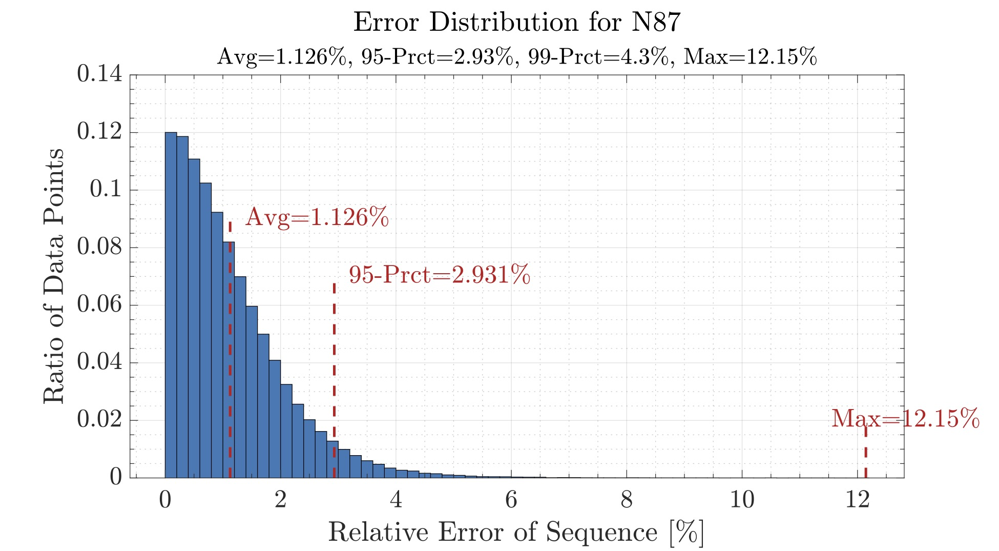

## MagNet Challenge 2023 November Preliminary Test

On November 1st, a preliminary test result is due to evaluate your already developed models for the 10 materials: 

- Step 1: Download the preliminary test data for the 10 existing materials [Dropbox](https://www.dropbox.com/sh/4ppuzu7z4ky3m6l/AAApqXcxr_Fnr5x9f5qDr8j8a?dl=0), each consisting of 5,000 randomly sampled data from the original database.

- Step 2: Use this database to evaluate the performance your already-trained models.

- Step 3: Report your results following the provided template. Zip your Models and Results and send it to pelsmagnet@gmail.com.

To calculate error between model predictions and the MagNet measurements, the relative error should be used (with the absolute value for the difference between the predicted and measured values). The metrics of interest are average relative error, the 95th percentile, as well as the maximum error.

$Percent\ Relative\  Error = \frac{\left |meas-pred \right |}{meas}\cdot 100$, where $meas$ is MagNet's Core Loss measurement and $pred$ is the model prediction.

The PDF report for the preliminary test should include the error distribution histograms for all ten materials utilizing this validation data, with the metrics of interest clearly visible. Attached is an example template for reporting the error distributions for the ten materials on the validation data, as well as a MATLAB script utilized to generate the graphs as an example.

(PDF template for ten materials coming soon)

* the above graph is just for illustrative purposes and should not be used for comparison.
